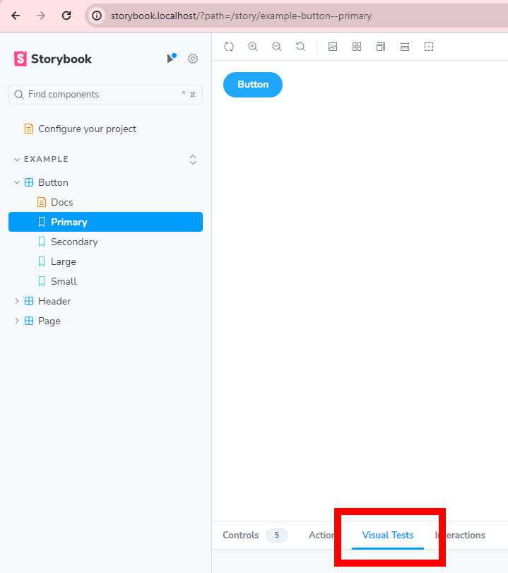

# Storybook
Dockerized storybook component library with all the goodies!

## Overview
* [Installing & Running Repository](#installing--running-repository)
    * [Prerequisites](#prerequisites)
    * [Clone & Install Repository](#clone--install-repository)
    * [Run Repository](#run-repository)
    * [Enable Visual Tests](#enable-visual-tests)
* [Run Tests](#run-tests)
* [All `make` Commands](#all-make-commands)
* [Knowledge](#knowledge)

## Installing & Running Repository

### Prerequisites
* [Docker Compose](https://docs.docker.com/compose/)
* a [Chromatic](https://www.chromatic.com/) account (for visual testing)

### Clone & Install Repository
```bash
git clone https://github.com/difuoan/storybook
cd storybook/
make init
```
Make sure to update the `.env` file with your credentials
```env
GIT_EMAIL=lucas.j.venturini@gmail.com
```
Then build the container.
```bash
make build
```

### Run Repository
```bash
make up
```

### Enable Visual Tests

Follow the setup process further. The next steps will be described in the "Visual Tests" panel inside the storybook UI (see screenshot &rarr;)
<br clear="right"/>

## Run Tests
You can view the results in the Coverage Report in the storybook UI.
```
make test
```

## All `make` Commands
```make
init # initialize env
up # start storybook
start # same as up
down # shut down storybook
stop # same as down
tail # docker logs
build # install everything needed
restart
clear # remove env
ps # show containers
test.unit # run vitests
test.story # run storybook tests
test # run all tests
```

## Knowledge
* [node.js](https://nodejs.org/en)
* [npm](https://docs.npmjs.com/)
* [Vue](https://vuejs.org/)
* [Vite](https://vitejs.dev/)
* [Docker](https://www.docker.com/)
* [Docker Compose](https://docs.docker.com/compose/)
* [GNU make](https://www.gnu.org/software/make/manual/make.html)
* [Traefik](https://doc.traefik.io/traefik/providers/docker/)
* [TypeScript](https://www.typescriptlang.org/)
